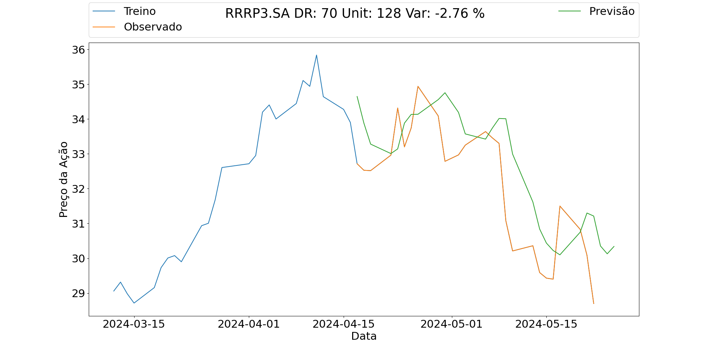

# Realizando Previsões com LSTM

Não é nosso intuito explicar a fundo o que é LSTM, porem, de forma resumida...

LSTM, sigla para Long Short-Term Memory, ou Memória de Longo e Curto Prazo em português, é um tipo de rede neural recorrente (RNN) projetada para superar o problema de dependência de longo prazo em dados sequenciais.

As LSTMs são utilizadas em diversas tarefas de aprendizado de máquina, principalmente no processamento de linguagem natural (PLN) e em séries temporais.

No nosso caso, como diz o titulo, utilizaremos o modelo para tentar prever o comportamento de algumas acoes e quem sabe, ficar milionário...

## Ferramentas Utilizadas


## Clonando Repositório

```bash
git clone
```

## Dependências

Existem algumas dependências necessárias para rodar o projeto, e vamos resolver isso facilmente com a instalação do poetry. Poetry é uma ferramenta interessante e recomendo conhece-la caso não tenha familiaridade.

```bash
pip install poetry
```

Acesse a pasta onde o repositório foi clonado. Estando na mesma pasta em que os arquivos `poetry.lock e pyproject.toml` execute o comando:

```bash
poetry install
```

Pronto, ambiente virtual criado e dependências instaladas.

## Utilização

ALERTA!

A execução deste tipo de ferramenta requer certo poder computacional por conta da utilização do ML, e de uma conexão com a internet ja que os dados são coletados on-line então, fica o alerta para possíveis lentidões.

Neste repositório existem dois arquivos. Um deles é um notbook python do qual tento descrever passo a passo do realizado assim é possível ir executando e entendendo bem o código, o segundo é um arquivo em python que faz a previsão em massa de quantos papeis voce tiver interesse.

Espero que os documentos carregam a clares necessária para a compreensão do código.

### `previsoes.py`

O arquivo `previsoes.py` recebe como parâmetros uma lista de ações e retorna ao final do script uma previsão do valor de cada ação em uma tabela bem como produz uma saída na pasta `src/imgs` de imagens dos gráficos das previsões encontradas pelo algorítimo.

Exemplo da Imagem de Saída:



Como pode observar, há certa distinção entre o real e o previsto. Esse resultado pode ser melhorado alterando alguns parâmetros. Fique livre para experimentar.

Exemplo da Tabela de Saída:

```bash
       Resumo das Ações        
┏━━━━━━━━━━━┳━━━━━━━━━━━━━━━━━┓
┃ Titulo    ┃ Prev. de Var. % ┃
┡━━━━━━━━━━━╇━━━━━━━━━━━━━━━━━┩
│ ITUB4.SA  │ -0.20           │
│ BRBI11.SA │ -0.01           │
│ RRRP3.SA  │ -2.76           │
│ LREN3.SA  │ -2.80           │
└───────────┴─────────────────┘
```
